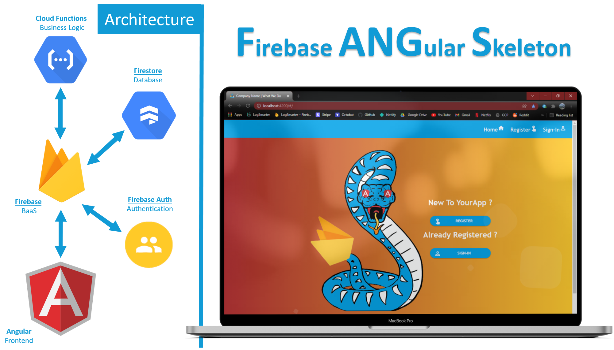
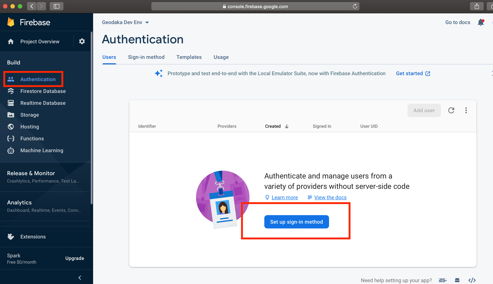
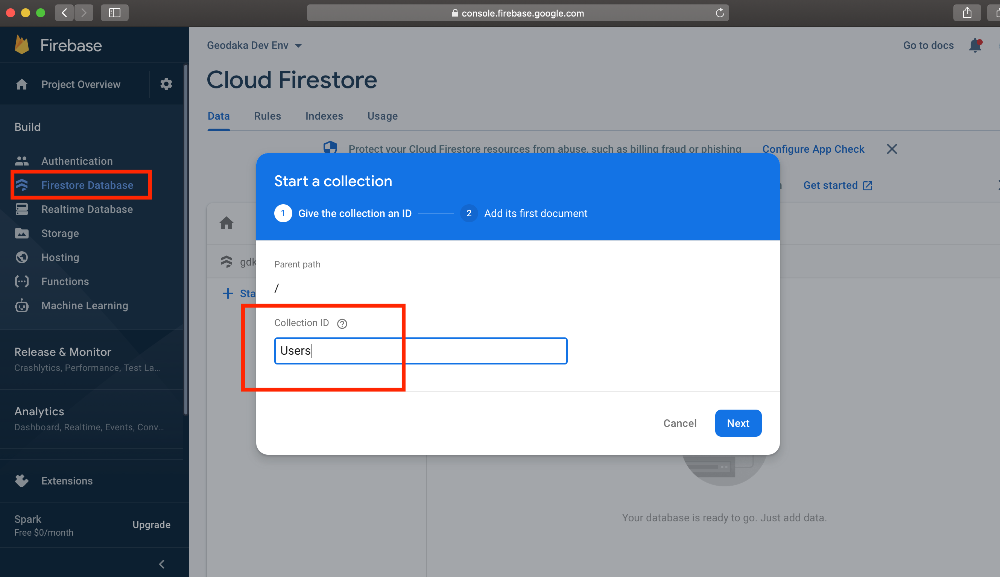

# FAngS - Firebase Angular Skeleton

`FAngS` lets you quickly create an application with a fully functional authentication, authorization and user management system. In less than an hour you can easily spin up an environment for your next project that lets you spend more time focusing on what provides value to your end users instead of the complex features they will take for granted.



Without any custom code being written, `FAngS` allows your end users to sign up, sign in, edit their profile, reset their password and change their email. With a few minor changes to the styles referenced by all of the components in `FAngS`, you will have your logo, theme colors and application name in all the right places. Its that simple to kick start your next project. `FAngS` comes ready with 100% testing and documentation coverage so you can feel confident in where you are starting from.

## Technologies Used

| Technology          | Version       |
| ------------------- | ------------- |
| Angular             | 13.1.1        |
| Node                | 12.22.5       |
| Firebase Functions  | 3.11.0        |

## Getting Started

Getting the project set up is simple and will only take a few minutes. This guide assumes you have an understanding of git. Check out the [git documentation](https://git-scm.com/doc) if you don't.

1. The first thing to do is clone the project. I would recommend forking the project first, then cloning if you plan to use it as a base for your next project. 

```
    git clone https://github.com/RyanLefebvre/FAngS
```

2. Next you'll need to [download and install node](https://nodejs.org/en/download/). Try to match or exceed the version the project is currently using. To verify that you have successfully installed node, you can check the version from the command line. 

```
    node --version
```

3. The next step is to create a Firebase Project. Go to the [Firebase console](https://console.firebase.google.com/) and click on the `Add project` button.

4. Once your project is created, you will be redirected to that project's management console. You have some set up that needs to be taken care of. First, go to the `authentication` tab underneath build. You can see it on the sidenav on the left side of the window. Then click on the `Set up sign-in method` button. At a minimum, select the option called `Email/Password` and enable it.



5. Next is your database, go to the `Firestore Database` tab underneath build. You can see it on the sidenav on the left side of the window. Click on the `Create Database` button. 

6. Now that the database is created, we need to add the Users table. Click on start collection and create a collection named `Users`. It will force you to create a document within the collection but its okay to just use the auto-id button and delete the document after if you don't want the one junk document in your database.



7. Go back to the Project Overview by clicking on the house icon above the Build section on the sidenav. You have to add an app to the project to generate client secrets. Choose the web option. During this process you'll be given a Firebase Config object in JSON format. Save this as we will need it again later. It should look something like below.

```
    const firebaseConfig = {
            apiKey: "XXXXXXXXXXXXXXXXXXX",
            authDomain: "XXXXXXXXXXXXXXXXXXX",
            projectId: "XXXXXXXXXXXXXXXXXXX",
            storageBucket: "XXXXXXXXXXXXXXXXXXX",
            messagingSenderId: "XXXXXXXXXXXXXXXXXXX",
            appId: "XXXXXXXXXXXXXXXXXXX",
    };
```

8. The last thing to do in the Firebase Console is create a service account for the cloud functions. Click on the gear icon next to `Project Overview` then select `Project settings` and go to the `Service accounts` tab. Click on the button that says `Generate new private key`. This will trigger a download of a JSON file, open it up and inside you'll see something like below. Make sure to save this file for later.

```
    {
        "type": "XXXXXXXXXXXXXXXXXXX",
        "project_id": "XXXXXXXXXXXXXXXXXXX",
        "private_key_id": "XXXXXXXXXXXXXXXXXXX",
        "private_key": "XXXXXXXXXXXXXXXXXXX",
        "client_email": "XXXXXXXXXXXXXXXXXXX",
        "client_id": "XXXXXXXXXXXXXXXXXXX",
        "auth_uri": "XXXXXXXXXXXXXXXXXXX",
        "token_uri": "XXXXXXXXXXXXXXXXXXX",
        "auth_provider_x509_cert_url": "XXXXXXXXXXXXXXXXXXX"
    }
```

9. Go back to the project you cloned in Step 1. Navigate to the src directory and create a subdirectroy called environments. In the environments subdirectory create a file called environment.ts. In this file create an object named environment that is exported. The object should have a key called `production` which is either true or false and one called `firebase`. The value of the firebase key in the environment object should be the contents of the firebase config object from step 7.

```
    cd FAngS/app/src
    mkdir environments
    cd environments
    touch environment.ts
```

Inside environment.ts you would have
    
```
    export const environment = {
    production: false,
    firebase: {
        apiKey: 'XXXXXXXXXXXXXXXXXXX',
        authDomain: 'XXXXXXXXXXXXXXXXXXX',
        projectId: 'XXXXXXXXXXXXXXXXXXX',
        storageBucket: 'XXXXXXXXXXXXXXXXXXX',
        messagingSenderId: 'XXXXXXXXXXXXXXXXXXX',
        appId: 'XXXXXXXXXXXXXXXXXXX',
      },
    };
```


10. Now install the projects frontend dependencies using NPM

```
    npm ci
```

11. Verify that the frontend unit tests work and show 100% testing coverage using the command below. The output from karma will show you the coverage in your terminal. You should also see a coverage directory that was generated inside the app directory. It contains an istanbul report with more information. If you open the index.html file inside the coverage directory in a browser you can see exactly which files are covered.

```
    npm run testWithCoverage
```

12. Verify that the frontend documentation works and show 100% coverage using the command below. You should see a documentation directory that was generated inside the app directory. If you open the index.html file inside the documentation directory in a browser you can access the projects documentation.

```
    npm run generateDocumentation
```

13. Now that the frontend is good to go, you need to set up the firebase cloud functions for the project. This is most easily done using the firebase-cli. If you haven't already, install the cli which is part of the [firebase-tools package](https://www.npmjs.com/package/firebase-tools). Using the CLI, you will have to login, choose to use the project, then initialize cloud functions. When prompted, be sure to choose TypeScript as the functions language and be absolutely sure not to overwrite any existing files when it asks you. That will definitely break things if you start overwriting those files. If you aren't sure what your Project ID is, you can run the command `firebase projects:list` to see all your projects and find the one with the correct ID.

```
    cd FAngS/cloud-functions
    npm install -g firebase-tools
    firebase login
    firebase projects:list
    firebase use YOUR_PROJECT_ID
    firebase init functions
```

14. Go back and grab the file from step 8. Rename it `service-account.json` and put it inside the functions directory.

15.  Now install the projects cloud function dependencies using NPM

```
    cd FAngS/cloud-functions/functions
    npm ci
```

16.  For the cloud functions to work, they need to be deployed. Run the following command. It might take a minute, but your cloud functions will be ready to go.

```
    firebase deploy --only functions
```

17. Verify that the backend unit tests work and show 100% testing coverage using the command below. The output from jest will show you the coverage in your terminal. You should also see a coverage directory that was generated inside the __tests__ directory. It contains an istanbul report with more information. If you open the index.html file inside the coverage directory in a browser you can see exactly which files are covered.

```
    npm run testWithCoverage
```

18. Verify that the backend documentation works using the command below. You should see a swagger.json file that was generated inside the functions directory. Paste the contents of this file into [editor.swagger.io](https://editor.swagger.io) to see the API documentation

```
    npm run generateDocumentation
```

19. At this point the project should be all set up for local development. Navigate to the frontend portion of the project (i.e. the app directory) and use the npm start command to run the project locally. Once the build finishes you can access the project on [localhost:4200](http://localhost:4200/)


20. DISCLAIMER - This isn't a step thats necessary, but it is worth mentioning. For some reason, cloud functions won't always work the first time they are deployed and will make it look like there are cors errors. If you run into that issue, then you will need to go into the GCP project for your firebase project and assign the allUsers service account a role of Cloud Functions Invoker. A better explanation can be found [here](https://github.com/firebase/functions-samples/issues/395#issuecomment-605025572).